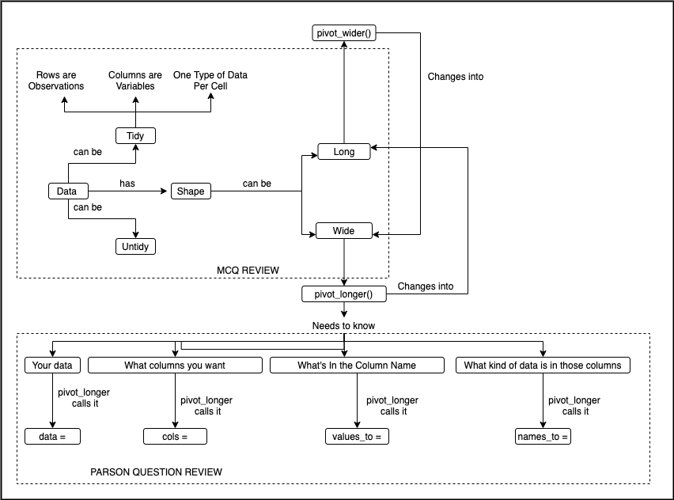

# RStudio Instructor Certification 

This repository contains the materials for David John Baker's [RStudio Instructor Certification](https://education.rstudio.com/trainers/) exam.

## Certificates

## Materials

* [Slides](https://docs.google.com/presentation/d/1MFstJ3qFF1kK5dHJubn7KsPb2kcPSmuLnvHSP3QiFEA/edit?usp=sharing)
* [Pre-Lesson Materials](guides/pivot_longer_outline.pdf)
* [Script](guides/pivot_longer_script.Rmd)
* [Lesson Notebook](guides/code_along.Rmd)

